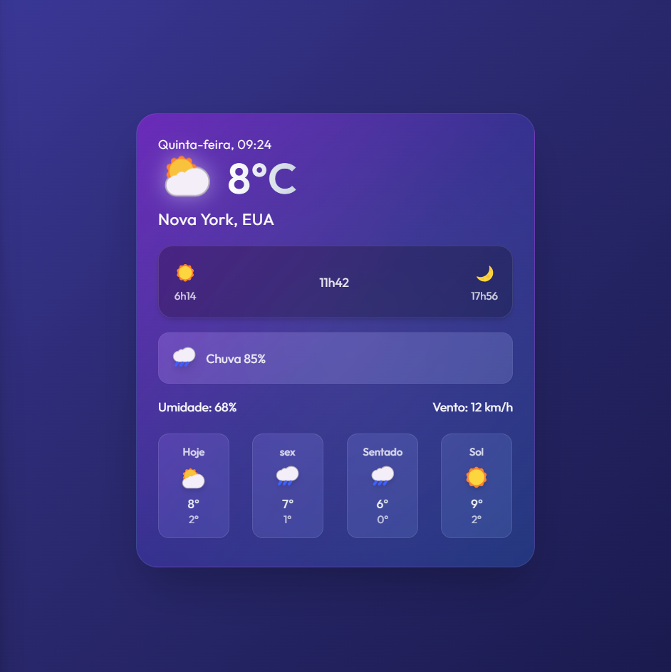

# ☁️ Cloud Widget 3D - Three.js

Este projeto é um **widget interativo em 3D de uma nuvem flutuante** com chuva animada, desenvolvido com [Three.js](https://threejs.org/). Ideal para dashboards, landing pages ou componentes modernos em sites com foco em interatividade e design futurista.

---

## ✨ Funcionalidades

- Renderização 3D em tempo real com **Three.js**
- Nuvens animadas com **movimento suave de flutuação**
- **Gotas de chuva animadas** e físicas básicas
- Rotação automática da cena com opção de pausa
- Interface adaptável com **estilo Neumorphism + Tailwind**
- Efeitos visuais suaves e integrados com fundo em `backdrop-blur`

---

## 🖼️ Demonstração

 <!-- Substitua por uma imagem se desejar -->

---

## 🚀 Tecnologias Utilizadas

- [Three.js](https://threejs.org/) – Engine gráfica WebGL
- [Tailwind CSS](https://tailwindcss.com/) – Estilização responsiva e moderna
- JavaScript (ES6+)
- HTML5 + CSS3

---

